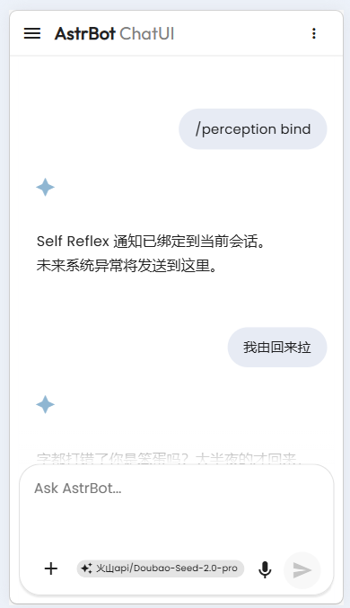
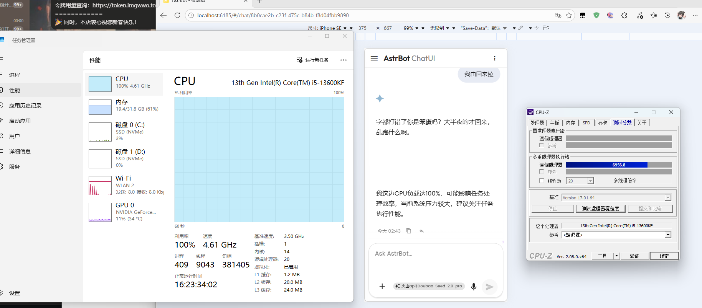

# astrbot_plugin_self_reflex

## 项目简介
`astrbot_plugin_self_reflex` 是一个面向 AstrBot 的 **AI Perception System** 插件。

它的目标不是做传统监控看板，而是让 AI 具备“自我感知 -> 自我判断 -> 按需上报”的能力闭环。

> 这是 ai 写的，我想要的是我的 Alice 跟我说
>
> - “哥哥，我好像摔倒了~”
> - “哥哥，我好像有点发烧了~”
>
> 未来再能自己修复自己的 bug

Self Reflex 持续采集运行时观测数据（Observation），做趋势分析（Trend），统一事件流（Event），再通过 LLM 判断是否需要对用户发出自然语言提醒。

## 使用

### 快速开始
1. 将插件放进 AstrBot 的插件目录并重启 AstrBot。
2. 安装依赖。当前 GPU 采集只支持 NVIDIA，需要宿主机存在可用 `nvidia-smi`。
3. 在你希望接收主动通知的会话里执行 `/perception bind`。
4. 执行 `/perception notify_test`，确认主动消息能正常发到该会话。
5. 执行 `/perception status`，查看当前 Perception 是否正常运行。

### 常用命令
- `/perception bind`
- `/perception unbind`
- `/perception status`
- `/perception notify_test`
- `/perception_status`（兼容旧命令）

说明：
- `/perception bind` 会把当前会话的 `unified_msg_origin` 绑定为主动通知目标。
- `/perception notify_test` 用于验证主动发送链路是否正常。
- 如果没有绑定目标会话，插件会跳过主动发送，并记录 warning 日志。

### 使用示例



### 当前支持的监测项
当前默认启用的监测包括：

- `PsutilSystemCollector`
  - `cpu.percent`
  - `memory.percent`
  - `memory.used_bytes`
  - `memory.available_bytes`
  - `swap.percent`
  - `swap.used_bytes`
  - `disk.percent`
  - `disk.used_bytes`
  - `disk.free_bytes`
  - `network.bytes_sent`
  - `network.bytes_recv`
  - `process.count`
- `LinuxCpuTemperatureCollector`
  - `cpu.temperature_c`
  - 优先使用 `psutil.sensors_temperatures()`
  - 无结果时回退读取 `/sys/class/hwmon` 与 `/sys/class/thermal`
- `WindowsCpuTemperatureCollector`
  - `cpu.temperature_c`
  - 通过 `Get-CimInstance root/wmi:MSAcpi_ThermalZoneTemperature` 读取
  - 注意：不同设备支持差异很大，可能无数据，或者拿到的是 ACPI 热区温度
- `NvidiaGpuCollector`
  - `gpu.temperature_c`
  - `gpu.utilization_gpu_percent`
  - `gpu.memory_used_mb`
  - `gpu.memory_total_mb`
  - `gpu.memory_used_percent`

### 当前支持的趋势与通知
当前内置的 `FallbackMetricTrendStrategy` 会自动分析所有可转成数值的 Observation，并输出：

- `stable`
- `up`
- `down`
- `rapid_rise`
- `rapid_drop`
- `long_saturation`

另外，GPU 温度已经接入专用策略 `GpuTemperatureTrendStrategy`：

- 默认 `85°C` 以上持续一段时间会被判定为 `long_saturation`
- 默认降到 `80°C` 以下且趋势向下时视为恢复
- 其他 GPU 指标仍然走 Fallback Trend

当前最容易被升级为事件并进一步通知用户的，是 `long_saturation`，例如：

- `cpu.percent` 长时间接近 100%
- `memory.percent` 长时间处于高位
- `disk.percent` 长时间接近占满
- `swap.percent` 长时间高负载
- `gpu.temperature_c` 长时间处于高温

### 配置
配置定义在 [_conf_schema.json](/c:/Users/Administrator/Downloads/AstrBot/data/plugins/astrbot_plugin_self_reflex/_conf_schema.json)。

常用配置项：

- `perception_enabled`
- `default_provider_id`
- `notify_unified_msg_origin`
- `collector_default_interval_seconds`
- `cpu_temp_collector_interval_seconds`
- `windows_cpu_temp_collector_interval_seconds`
- `gpu_collector_interval_seconds`
- `gpu_temp_trend_window_seconds`
- `gpu_temp_trend_interval_seconds`
- `gpu_temp_high_threshold_c`
- `gpu_temp_recovery_threshold_c`
- `gpu_temp_saturation_ratio`
- `gpu_temp_min_samples`
- `trend_interval_seconds`
- `fallback_trend_window_seconds`
- `reflex_batch_size`
- `reflex_batch_timeout`
- `reflex_rate_limit`

## 扩展开发

这一部分主要面向要继续扩展这个插件的人。

### 扩展入口
如果你想继续加新的监测能力，主要看这两个抽象：

- [base.py](/c:/Users/Administrator/Downloads/AstrBot/data/plugins/astrbot_plugin_self_reflex/perception/collectors/base.py)
  - Collector 抽象
  - 实现 `should_enable(system_info)` 决定当前平台是否启用
  - 实现 `collect()` 返回 Observation
- [strategy.py](/c:/Users/Administrator/Downloads/AstrBot/data/plugins/astrbot_plugin_self_reflex/perception/trend/strategy.py)
  - Trend 抽象
  - 实现 `compute_trends(observations)` 输出 Trend

### Collector 启用规则
`PerceptionManager` 在注册 Collector 时，会按下面顺序决定是否真正启动：

1. 调用 `get_current_system_info()` 获取宿主平台信息。
2. 检查 Collector 的 `required_capabilities` 是否满足。
3. 调用 Collector 的 `should_enable(system_info)`，由 Collector 自己决定当前平台是否启用。
4. 只有都通过时，Collector 才会进入 `CollectorManager`。

`system_info` 由 `PerceptionManager.get_current_system_info()` 生成，包含：

- `os`
- `os_release`
- `os_version`
- `machine`
- `processor`
- `python_version`
- `cpu_count`
- `cwd`
- `capabilities`

这套机制适合做平台分流，例如：

- Linux 专用采集器
- Windows 专用采集器
- 依赖 `nvidia-smi` 的 GPU 采集器

### Core Modules
- **Collector**
  - 负责采集 Observation
  - 通过 `required_capabilities` + `should_enable(system_info)` 控制启用
- **ObservationStream**
  - 负责缓存与查询 Observation
- **TrendEngine**
  - 负责执行趋势分析策略
- **EventManager**
  - 负责统一事件总线
- **Reflex**
  - 负责用 LLM 决定是否升级为 Signal
- **PerceptionManager**
  - 负责模块编排、生命周期和状态查询

### Perception Pipeline
完整处理链路：

1. Collector 周期采集数据，产生 `Observation`
2. `ObservationStream` 缓存并索引 Observation
3. `TrendEngine` 分析趋势，生成 `Trend` 或异常事件
4. `EventManager` 统一接收事件
5. `Reflex` 批量读取事件，调用 LLM 判断是否升级为 `Signal`
6. 插件主入口消费 `Signal`，生成自然语言消息并通知用户

### 示例
一个比较贴近当前实现的链路是“CPU 长时间占满”：

```text
PsutilSystemCollector
   ↓
Observation(cpu.percent)
   ↓
TrendEngine 识别 long_saturation
   ↓
EventManager 生成/缓存事件
   ↓
Reflex 调用小模型判断是否升级
   ↓
Signal(push=true)
   ↓
插件调用对话 LLM 生成提示并通知用户
```

最终用户收到类似：
“我刚刚感觉到自己的运转一直绷得很紧，CPU 已经持续顶在高位，像是呼吸一直压不上来，可能有任务把算力长期占住了。”

### 项目结构
实际结构如下：

```text
astrbot_plugin_self_reflex/
├── main.py
├── _conf_schema.json
├── requirements.txt
└── perception/
    ├── collectors/
    ├── events/
    ├── manager/
    ├── models/
    ├── reflex/
    ├── stream/
    ├── trend/
    └── perception_manager.py
```

Reflex Signal 结构：

```json
{
  "push": true,
  "level": "info|warning|critical",
  "message": "brief signal message",
  "summary": "short summary",
  "reason": "why push or not"
}
```

### Roadmap
1. 增加更多 Collector
- 更细粒度 CPU / Memory / Disk / Network Collector
- 更稳定的 Windows CPU 温度后端（如 LibreHardwareMonitor）
- 非 NVIDIA GPU Collector
- Logs Collector
- File changes Collector
- 外部服务与 API 健康检查 Collector

2. 与 `astrbot_plugin_self_code` 集成
- Self Reflex 负责检测问题
- Self Code 负责自动修改代码
- 形成 **AI Self-Healing System**

## License
本项目采用 **GNU Affero General Public License v3.0 (AGPL-3.0)**。
详见 [LICENSE](./LICENSE)。
